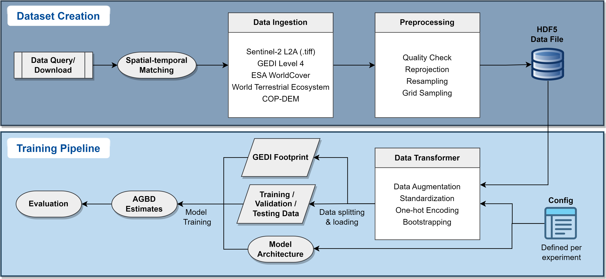
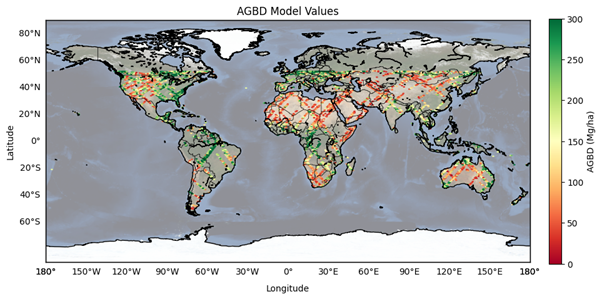

# Forest Biomass Estimation using CNNs and Sentinel-2 Imagery

## 🌍 Introduction

Forest biomass plays a crucial role in sustainable forest management and the global carbon cycle. Accounting for over 30% of the terrestrial carbon pool, biomass changes impact environmental factors such as land cover conversion, greenhouse gas emissions, and hydroclimates. Remote sensing has emerged as an efficient tool for above-ground biomass estimation and monitoring. 

This project leverages Convolutional Neural Networks (CNNs) to estimate above-ground biomass density (AGBD) at a global scale using Sentinel-2 imagery and GEDI LiDAR data. The CNN architecture is adapted from Nico Lang's model for canopy height mapping to predict biomass density. This project is part of the [ESA Natural Capital Kick-Start](https://business.esa.int/funding/invitation-to-tender/natural-capital) and the results have been published on [ICLR - 2024](https://ml-for-rs.github.io/iclr2024/) (Machine Learning for Remote Sensing) in Vienna.


## 🛠 Methods

This project utilizes **PyTorch Lightning deep learning framework** for the CNN expereiments. The goal is to build an optimized model to **predict forest carbon stock worldwide from Sentinel-2 imagery**, based on GEDI Level 4 labels. It utilizes techniques such as bootscrapping, weighted sampling, and monte carlo dropout attempting to overcome common challenges such as saturation issues and imbalanced data. Some of the parameters are optimzied via grid search before running the predefined experiments, all set up in the configs to be initialized in the main script. The exploration of training data can be found in the Jupyter notebook. The data processing pipeline is visuzlized as follow:



- **Data Collection:**
  - Over **2 million** globally distributed data points.
  - Sentinel-2 L2A spectral bands, GEDI Level 4 AGBD, ESA WorldCover, World Terrestrial Ecosystem (WTE), and CopDEM elevation data.
  - Independent test set of **332,544** image patches.

- **Preprocessing:**
  - Quality checks for cloud-free Sentinel-2 data and flat terrain selection.
  - All datasets merged into a single **HDF5** file for efficient processing.

- **Model Architecture:**
  - Based on **ResNet** with depth-wise separable convolutions.
  - Composed of an entry block and **8 residual blocks**.
  - Skip connections to enhance feature propagation.

- **Training Strategy:**
  - Batch size: **32** | Weight decay: **0.001** | Optimizer: **Adam**
  - Early stopping with patience of **10 epochs**
  - Evaluating different feature combinations: land cover, vegetation indices, climate data, and Monte Carlo dropout.


## 📊 Results

| Exp | Model Inputs                          | RMSE (Mg/ha) | MAE (Mg/ha) | MAPE (%) |
|-----|------------------------------------|--------------|-------------|----------|
| 1   | Sentinel-2 only                   | 82.4         | 37.7        | 86.6     |
| 2   | Sentinel-2, DEM, geo-coordinates  | 81.1         | 35.9        | 79.6     |
| 3   | Sentinel-2, ESA WorldCover        | 82.7         | 36.1        | 71.5     |
| 4   | Sentinel-2, WTE                   | 83.2         | 37.95       | 87.4     |
| 5   | Sentinel-2, Vegetation Indices    | 83.59        | 37.05       | 83.7     |
| 6   | Sentinel-2, Monte Carlo Dropout   | 83.6         | 37.1        | 76.2     |

- Incorporating **DEM elevation and geolocation** improved model performance significantly.
- Saturation issues persisted in high biomass regions (>200 Mg/ha AGBD).
- Model performance varied across climate zones, particularly in **moist tropical and subtropical regions** with high carbon stock.




## 🎯 Conclusion

- This deep learning approach demonstrates **global-scale biomass estimation** at **10m resolution**, eliminating reliance on field surveys.
- The CNN model effectively captures biomass density but struggles with **high-carbon stock saturation**.
- **Future Enhancements:**
  - Local calibration and spatial aggregation.
  - CNN ensemble models to improve robustness.
  - Incorporating multi-temporal Sentinel-2 imagery for biomass change detection.


## 🚀 Repository Structure

```
📜 explore_mini_training_set.ipynb
📜 ICLR_2024_paper.pdf   # Published paper
📂 fig                   # Key figures for project
📂 results               # Performance metrics
📂 src
 ┣ 📂 configs            # Settings for CNN expereiments
 ┣ 📂 dataset_generation # Scripts for updating training 
 ┣ 📂 models             # Model architecture
 ┣ 📂 spare              # Other scripts
 ┣ 📂 utils              # Processing scripts
 Main scripts
 ┣ 📜 __init__.py        
 ┗ 📜 main.py
```
